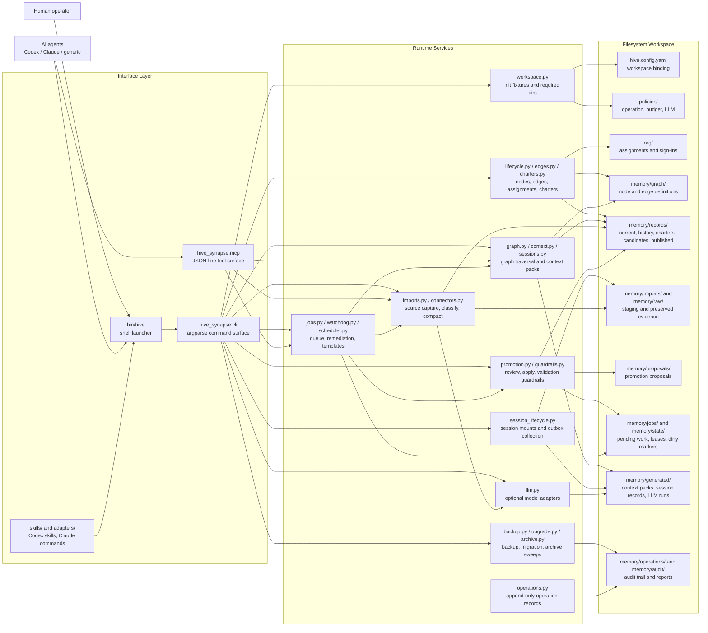
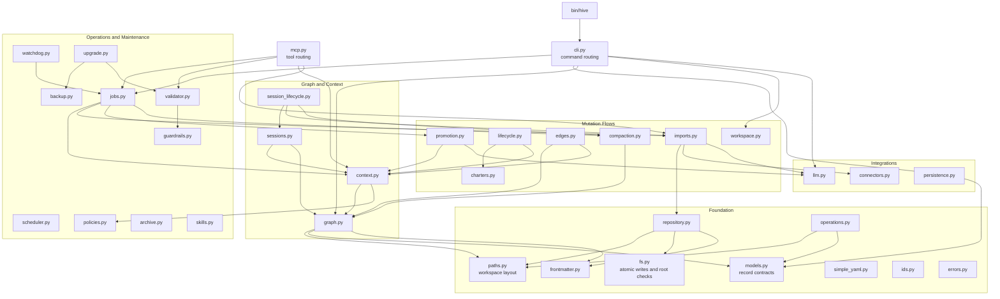
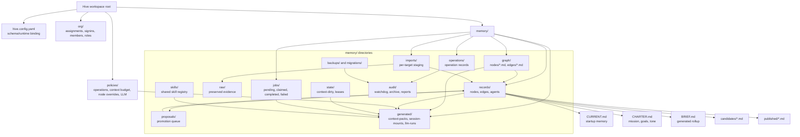
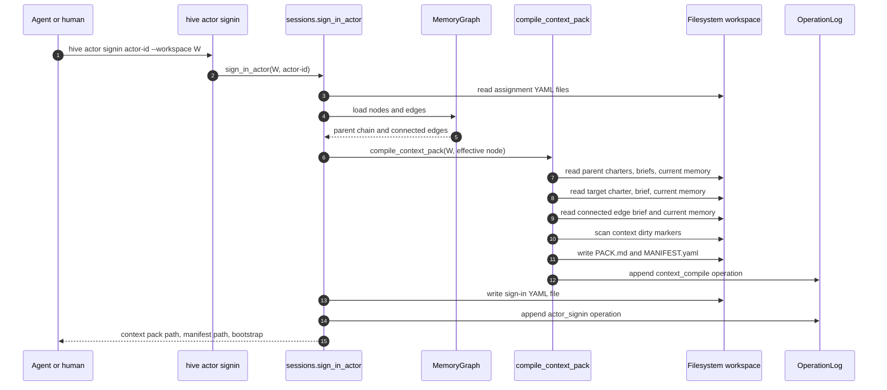
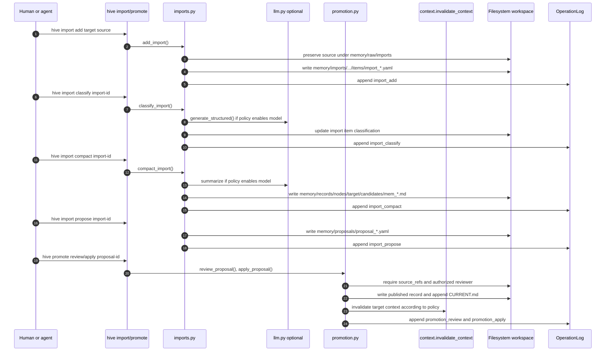
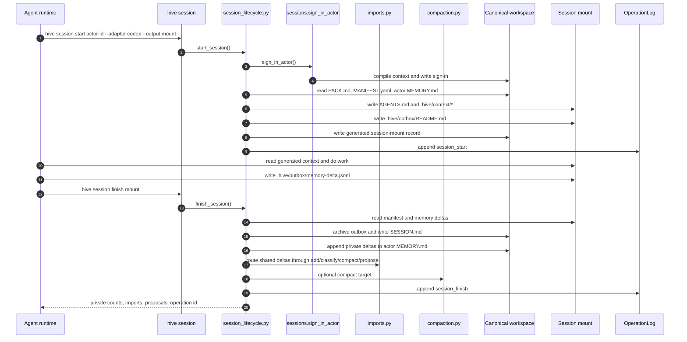
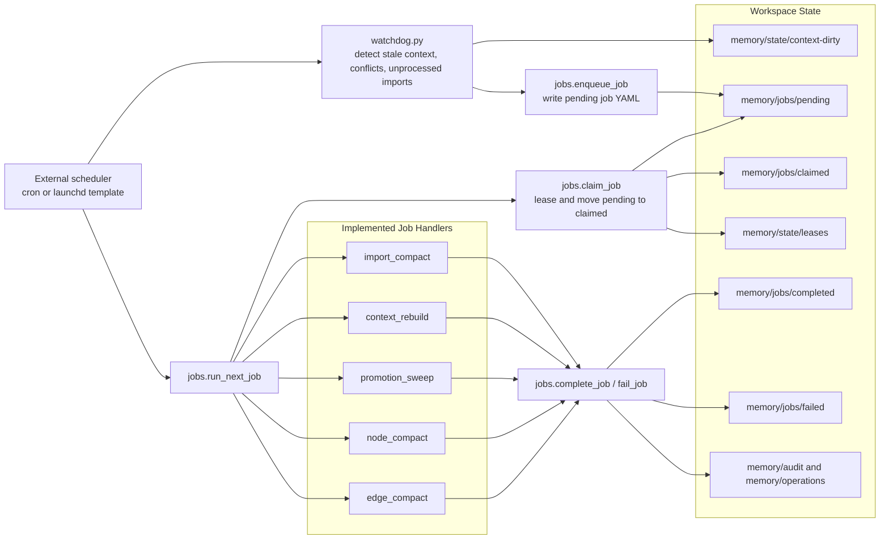

# Hive Synapse Architecture Map

Generated: 2026-05-16

This document maps the Hive Synapse codebase into a visual architecture. It is meant to help a reader move from the product concept to the files that implement it.

Hive Synapse is a dependency-light Python CLI/MCP runtime for a Markdown/YAML workspace. The runtime owns commands, validation, compilation, governance, jobs, adapters, and optional LLM calls. The workspace owns organization memory, graph records, imports, proposals, context packs, operation logs, and generated session mounts.

## Source Coverage

This map was compiled from:

- Runtime source: `src/hive_synapse/*.py`
- CLI entrypoint and package metadata: `bin/hive`, `pyproject.toml`
- Tests: `tests/test_*.py`
- Documentation: `README.md`, `docs/*.md`
- Agent packaging: `skills/hive/*`, `adapters/codex/*`, `adapters/claude/*`
- Workspace contract examples: `fixtures/workspaces/basic-org/**`, `templates/**`
- Design context: the untracked `designs` symlink was read as reference material, but the mapped implementation source of truth is the repository code and docs.

Reusable Mermaid sources live under `docs/diagrams/`.

## How To Read This

Start with the system overview, then follow one workflow:

- Agent startup: System Overview -> Runtime Module Map -> Actor Sign-In and Context Compilation.
- Shared memory ingestion: System Overview -> Import to Promotion Flow -> Workspace Data Model.
- Session mounts: System Overview -> Session Lifecycle Flow.
- Maintenance automation: Jobs and Maintenance Flow -> Workspace Data Model.

## System Overview

Primary diagram source: [`docs/diagrams/system-overview.mmd`](diagrams/system-overview.mmd)

## Runtime Module Map

Primary diagram source: [`docs/diagrams/runtime-module-map.mmd`](diagrams/runtime-module-map.mmd)

## Workspace Data Model

Primary diagram source: [`docs/diagrams/workspace-data-model.mmd`](diagrams/workspace-data-model.mmd)

## Actor Sign-In And Context Compilation

Primary diagram source: [`docs/diagrams/actor-context-sequence.mmd`](diagrams/actor-context-sequence.mmd)

## Import To Promotion Flow

Primary diagram source: [`docs/diagrams/import-promotion-sequence.mmd`](diagrams/import-promotion-sequence.mmd)

## Session Lifecycle Flow

Primary diagram source: [`docs/diagrams/session-lifecycle-sequence.mmd`](diagrams/session-lifecycle-sequence.mmd)

## Jobs And Maintenance Flow

Primary diagram source: [`docs/diagrams/jobs-maintenance.mmd`](diagrams/jobs-maintenance.mmd)

## Code-To-Concept Index

| Concept | Implementation files | Notes |
|---|---|---|
| CLI command surface | `bin/hive`, `src/hive_synapse/cli.py` | `build_parser()` defines command groups and maps each subcommand to a handler. |
| Workspace layout | `src/hive_synapse/paths.py`, `src/hive_synapse/workspace.py`, `templates/` | `REQUIRED_DIRS` defines the workspace contract; `hive init` creates it. |
| Data contracts | `src/hive_synapse/models.py`, `src/hive_synapse/simple_yaml.py`, `src/hive_synapse/frontmatter.py` | Lightweight model validation and Markdown/YAML frontmatter parsing. |
| Graph traversal | `src/hive_synapse/graph.py` | Loads node and edge records, computes parents, descendants, connected edges, and impact. |
| Context packs | `src/hive_synapse/context.py`, `src/hive_synapse/sessions.py` | Compiles inherited parent, target, edge, and dirty-marker context into generated packs. |
| Node and edge lifecycle | `src/hive_synapse/lifecycle.py`, `src/hive_synapse/edges.py`, `src/hive_synapse/charters.py` | Creates records, memory files, import workspaces, policies, and invalidations. |
| Imports | `src/hive_synapse/imports.py`, `src/hive_synapse/connectors.py` | Preserves evidence, records external refs, classifies, compacts, and creates candidates. |
| Governance and promotion | `src/hive_synapse/promotion.py`, `src/hive_synapse/guardrails.py`, `src/hive_synapse/validator.py` | Enforces source refs, review metadata, authority transitions, and validation. |
| Session mounts | `src/hive_synapse/session_lifecycle.py` | Materializes harness-ready mounts and collects outbox deltas back into Hive. |
| Jobs and scheduling | `src/hive_synapse/jobs.py`, `src/hive_synapse/watchdog.py`, `src/hive_synapse/scheduler.py` | Filesystem queue, leases, watchdog reports, cron/launchd templates. |
| Audit and recovery | `src/hive_synapse/operations.py`, `src/hive_synapse/backup.py`, `src/hive_synapse/upgrade.py`, `src/hive_synapse/archive.py` | Append-only operation records, backup, rollback preview, migration, archive sweeps. |
| Agent adapters | `skills/hive/`, `adapters/codex/`, `adapters/claude/`, `scripts/install-agent-skills.py` | Harness packaging around the same CLI semantics. |
| Optional model layer | `src/hive_synapse/llm.py` | Deterministic default plus OpenAI-compatible, Anthropic, LiteLLM, and command providers. |
| Tests proving flows | `tests/test_e2e_fixture.py`, `tests/test_import_context.py`, `tests/test_actor_signin.py`, `tests/test_session_lifecycle.py`, `tests/test_promotion_jobs.py` | Exercise the main lifecycle flows shown above. |

## Architectural Takeaways

- The runtime is intentionally filesystem-first and dependency-light. Markdown/YAML remains the canonical store.
- Generated artifacts are rebuildable. `memory/generated/context-packs`, session materializations, and LLM run records should not be treated as user-authored source of truth.
- Shared memory changes are mediated: imports create candidates, proposals capture intent, authorized review applies published memory, and context invalidation marks dependent packs stale according to policy.
- Agent session mounts are disposable views over canonical memory. Agents read generated context and write durable deltas to an outbox; `hive session finish` routes those deltas back through private memory or governed shared-memory workflows.
- Operation records are the audit spine. Most mutating flows append `memory/operations/op_*.yaml` with changed files, changed records, and rollback strategy metadata.
